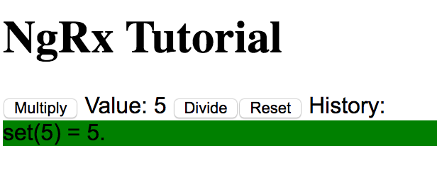
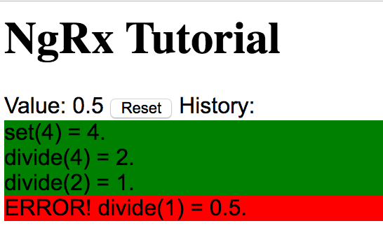

# NGRX Tutorial in Typescript

Follwing the tutorial at [NGRX](https://ngrx.io/guide/store)

## Feature

You can play the 3n+1 game here.

Decide whether you want to multiply or divide the current number.

The screen shows the steps you took.

A sample:

